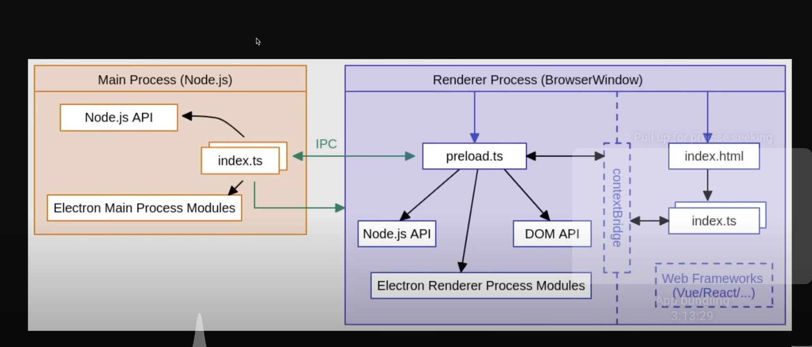

# Electron notes

## How the processes relate

- 2 processes: Main and Renderer
- Main process creates the BrowserWindow instance
- main process handles privileged operations, file system, etc
- context isolated process
- renderer process handles DOM and other UI operations
- preload script is a script that runs in the renderer process before the page is loaded
- can access both main and renderer processes
- access main process via ipc
